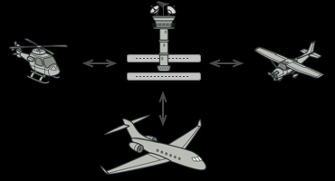
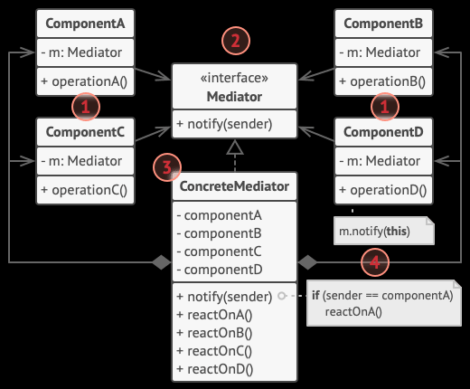

## Mediator

管制官が飛行機の発着陸を管理しようとした場合、各飛行機からの連絡を受け、それを適切に判断して、別の飛行機に指令を出します

このように各クラスやコンポーネントからの情報を受け取り、それを処理して、必要なコンポーネントの通知する働きをするのがMediatorです

他の例としてはチャットが分かりやすいです

チャットルーム(ストア)が、参加者のチャットメッセージを受け取り、メッセージを指定された相手に送信します。

このとき、ChatRoomクラスがMediatorの働きをします

### クラス図

