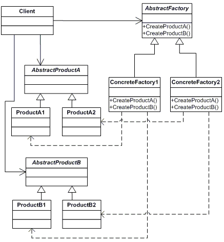
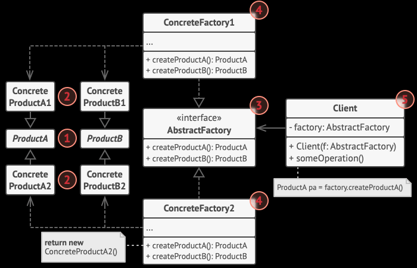

## Abstract Factory
https://www.dofactory.com/net/abstract-factory-design-pattern
https://refactoring.guru/design-patterns/abstract-factory

使用頻度 ★★★★★

Abstract Factoryパターンは、関連するインスタンスの生成APIを抽象化クラスに集約し（= 生成に関するインターフェースを定義し）、生成処理は抽象化クラスを継承（実装）したクラスに任せる設計手法です

依存しあうクラス群を生成する処理を集約化し、複数クラスの再利用性が向上します

### Factory Methodとの違い
「Factory Method」パターンは、『オブジェクト生成』の抽象化にポイントを置いたパターンであるのに対し、「Abstract Factory」パターンは、『関連するオブジェクト郡をまとめて生成するための手順』の抽象化にあります。

### UML

### 定義
|  クラス名  |  説明  |
| ---- | ---- |
|  Client  |  AbstractFactoryを用いて、各インスタンスを生成するクラス  |
|  AbstractFactory |  各部品（インスタンス）の生成方法を定義した抽象クラス  |
|  AbstractProductA, B  |  部品（抽象）  |
|  ProductA, B |  部品 |
|  ConcreteFactory1, 2  |  各部品（インスタンス）の生成方法を定義したクラス  |

1. Abstract Products declare interfaces for a set of distinct but related products which make up a product family.

2. Concrete Products are various implementations of abstract products, grouped by variants. Each abstract product (chair/sofa) must be implemented in all given variants (Victorian/Modern).

3. The Abstract Factory interface declares a set of methods for creating each of the abstract products.

4. Concrete Factories implement creation methods of the abstract factory. Each concrete factory corresponds to a specific variant of products and creates only those product variants.

5. Although concrete factories instantiate concrete products, signatures of their creation methods must return corresponding abstract products. This way the client code that uses a factory doesn’t get coupled to the specific variant of the product it gets from a factory. The Client can work with any concrete factory/product variant, as long as it communicates with their objects via abstract interfaces.

