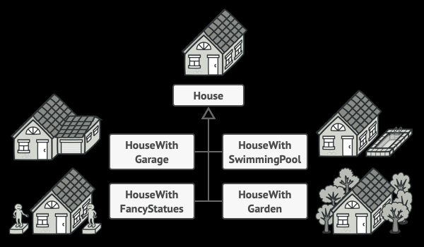
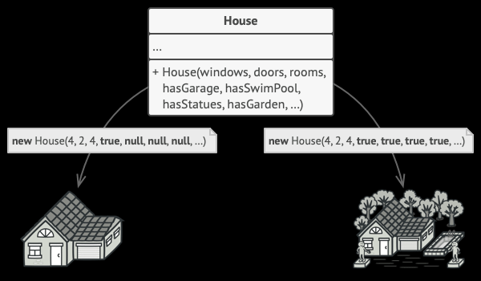
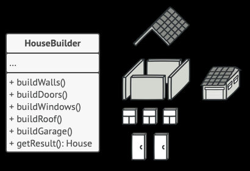
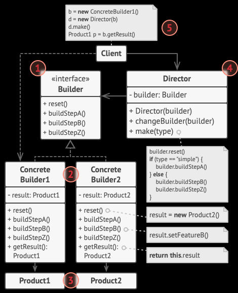

## Builder

参考URL https://refactoring.guru/design-patterns/builder

### 問題
以下のように、ある家を作ろうとしたとします
家はそれぞれ似たような部品を組み合わせて作りますが、完成する家はそれぞれ違います

これをクラスで作成しようとすると、家に合わせたコンストラクタを実装しなければなりません

これでは、家が増えればその分だけコンストラクタが増えてしまいます。

### 解決方法
この問題を解決する手段がBuilder Patternです

HouseBuilderクラスを作成し、その中で部品をメソッドとして実装させます

さらに、Directorクラスを使用します。Directorクラスは、Bulderへの一連の呼び出しを抽出して指示します

Directorクラスはビルドステップの実行順序や実行対象を定義し、Builderクラスはそれらのステップの実装を提供します。

### 具体的なクラス構成

1. Builder Interface

    すべてのタイプのビルダーに共通する製品構築ステップを宣言します。

2. Concrete Builder

    
    建設ステップのさまざまな実装を提供します。コンクリートビルダーは、共通のインターフェースに従わない製品を製造する場合があります。

3. Product
    
    生成オブジェクトです。異なるビルダーによって構築された製品は、同じクラス階層またはインターフェースに属している必要はありません。

4. Director
    
    構築ステップを呼び出す順序を定義するため、製品の特定の構成を作成して再利用できます。

5. Client
    
    ビルダーオブジェクトの1つをディレクターに関連付ける必要があります。通常、これは、ディレクターのコンストラクターのパラメーターを介して1回だけ実行されます。次に、ディレクターはそのビルダーオブジェクトをすべての以降の構築に使用します。ただし、クライアントがビルダーオブジェクトをディレクターのプロダクションメソッドに渡す場合の代替アプローチがあります。この場合、ディレクターで何かを作成するたびに、異なるビルダーを使用できます。

